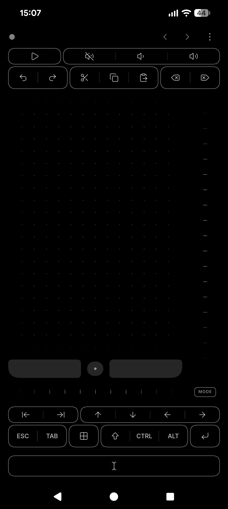
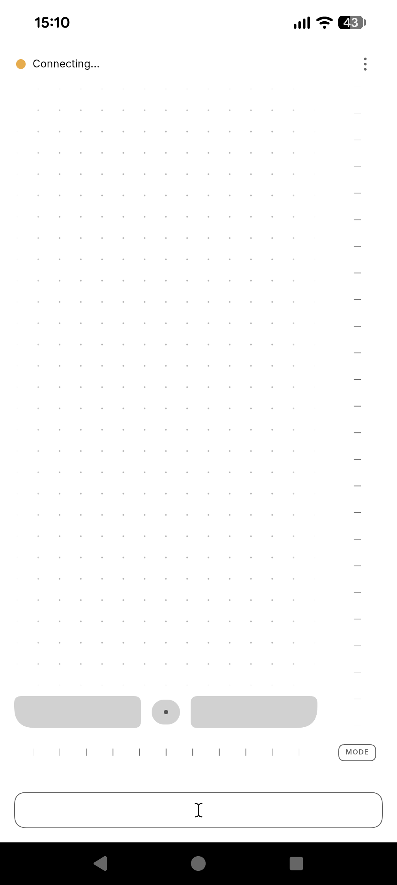
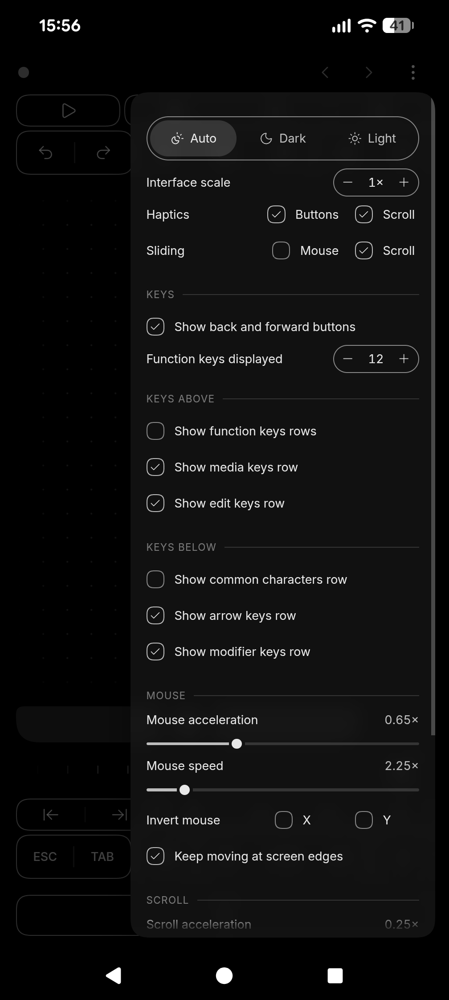
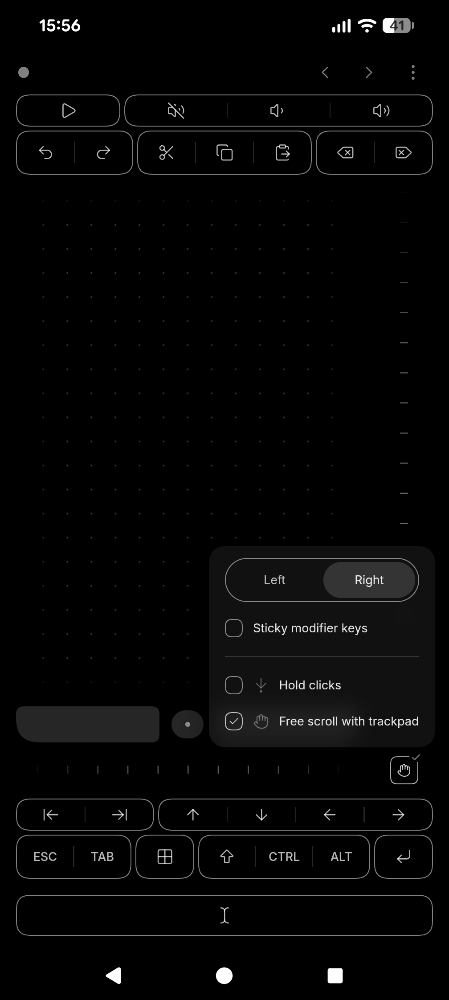
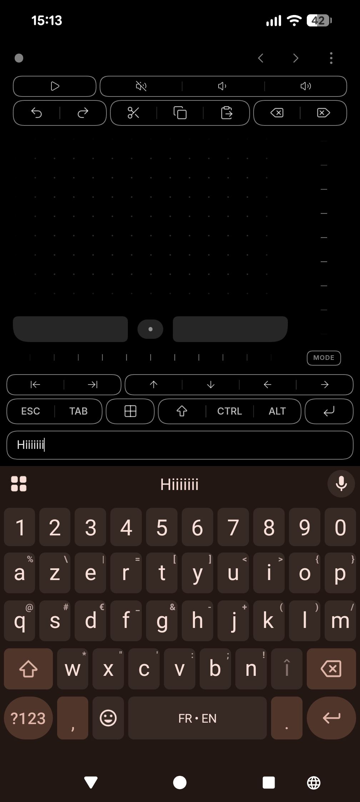
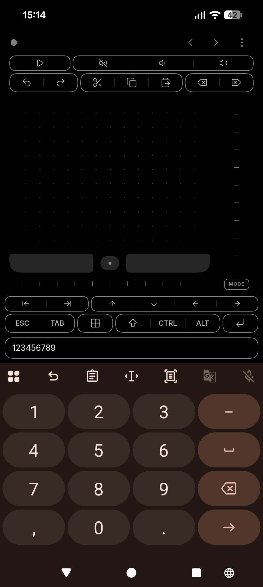
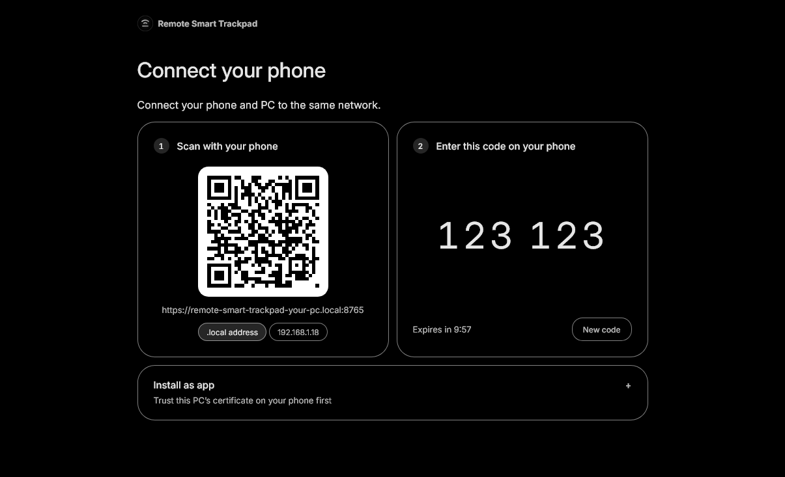

# Remote Smart Trackpad

Who doesn't love a little over-engineered smart trackpad-keyboard solution?
Works locally, only on Windows for now. Start the server on the PC (can be set to start with Windows) and use on your phone browser. The UX is optimized to feel native. Minimal setup, scan a QR code and you're ready to go. Can be used a PWA too.

The PC text is synchronized (when possible) with the phone's text input, you can edit right from your phone (auto-correct, speech-to-text, swipe typing, etc.) and the PC's caret and selection are mirrored in realtime.

_Bravo, you can now use your computer on your couch._

 

  
  
  
  

  
  

  

 

---

 

## Features

### Pointer and scrolling

| Feature            | What it does                                                                                                                                                | UX notes                                                                                                                                                       |
| ------------------ | ----------------------------------------------------------------------------------------------------------------------------------------------------------- | -------------------------------------------------------------------------------------------------------------------------------------------------------------- |
| Near real-time     | Pointer and scroll motion is batched once per screen frame.                                                                                                 | Motion never queues up behind a slow network: what arrives is always the latest movement, so the pointer stays under your finger instead of catching up later. |
| Trackpad gestures  | Tap clicks, two quick taps double-click, tap then touch-and-move drags with the left button held.                                                           | A single tap waits 250 ms for a possible second one. The dot pattern moves with your finger, so the pad itself shows that it is following.                     |
| Acceleration       | An S-curve damps slow strokes and amplifiesx flicks; separate speed and acceleration for mouse and scroll.                                                  | Precise for small targets, fast across a large screen. Set 0x to turn acceleration off.                                                                        |
| Mouse buttons      | Left, middle and right buttons that can be held while the other finger moves.                                                                               |                                                                                                                                                                |
| Scroll rails       | A vertical and a horizontal rail with your phone's native scrolling and momentum.                                                                           | Smooth scrolling also feels nice.                                                                                                                              |
| Edge motion        | **Keep moving at screen edges**: while dragging, resting your finger near the phone's edge keeps the pointer going.                                         | No need to let go of a click & drag anymore.                                                                                                                   |
| Scroll one step    | A double tap on a scroll rail will scroll one step, per axis.                                                                                               | For stepping through slides, Zen Spaces or lists without dragging.                                                                                             |
| Modes              | **Hold clicks** keeps a mouse button down until the next tap. **Free scroll** will turn the trackpad into a easy 2D scroll zone to navigate canvas apps. | Easy to access and toggle from the Mode menu.                                                                                                                  |
| Left or right hand | Puts the vertical rail and the Mode button on the side of the hand holding the phone.                                                                       |                                                                                                                                                                |

### Keys

| Feature              | What it does                                                                                                                                                              | UX notes                                                                  |
| -------------------- | ------------------------------------------------------------------------------------------------------------------------------------------------------------------------- | ------------------------------------------------------------------------- |
| Key rows             | Function keys (4 to 24), media, editing (undo, redo, cut, copy, paste, delete), common shortcut letters, arrows and Home/End, modifiers with Esc, Tab, Windows and Enter. | Choose which rows show and whether each sits above or below the trackpad. |
| Media state          | Play/pause and mute show the PC's actual playback and mute state.                                                                                                         |                                                                           |
| Auto-repeat on press | Keys like volume, undo or arrows repeat while held, like a physical keyboard.                                                                                             | Some keys only fire once never repeat, like Escape.                       |
| Modifiers            | Tap Shift, Ctrl, Alt or Windows, then a key: the shortcut goes out and the modifiers let go. With the sticky modifiers mode they stay on until disabled.                  | Shortcuts with one thumb; scrolling and moving the pointer keep them on.  |
| Back and forward     | Two buttons in the top bar send Alt+Left and Alt+Right for browsing history.                                                                                              | Can be hidden.                                                            |

### Text

| Feature                 | What it does                                                                                                                         | UX notes                                                                                                                                                  |
| ----------------------- | ------------------------------------------------------------------------------------------------------------------------------------ | --------------------------------------------------------------------------------------------------------------------------------------------------------- |
| Mirroring               | The phone's text field shows the text of the PC's focused field and follows it while the editor is open.                             | Read about every 200 ms while you type, less often when nothing changes, and nothing at all while the editor is closed.                                   |
| Selection sync          | The caret and selection go both ways: select on the PC and the phone shows it, move the caret on the phone and the PC follows.       | Your phone's keyboard tools (word suggestions, cursor dragging, select all, drag delete key) work on the PC's text.                                       |
| Phone keyboard features | Typing goes through your phone's keyboard: autocorrect, suggestions, swipe typing, voice input, other languages and IME composition. | Changes are sent as small edits once a composed word is committed; the PC applies each one only if its field is still the one it was meant for.           |
| Field type              | The PC tells the phone what the field takes: email, phone number, number, URL, search or a terminal.                                 | The phone shows the matching keyboard: @ and .com for an email, a number pad for digits, a search key, lowercase with no autocorrect in a terminal.       |
| Placeholders filtered   | A field's hint text ("Search…", "Type a message") never shows up as if it were typed.                                                | Checked through IAccessible2 for Chrome, Edge, Electron apps and Firefox, which tell typed text from text the page only draws.                            |
| Safe Enter              | The phone's Enter key adds a line break without sending the message only in textareas.                                               | The Enter key in the key rows still sends a real Enter.                                                                                                   |
| Blind typing            | Fields the phone cannot read (code editors, terminals, password fields) still take typing: it goes to the PC as text and keys.       | What you typed stays on the phone while the PC's caret is right after it, so you can fix a typo with Backspace; a click elsewhere on the PC clears it.    |
| Keyboard stays up       | Every control (trackpad, keys, rails, options) leaves the focus in the text field.                                                   | You can click, scroll or press shortcuts without the keyboard closing and the layout jumping. Tapping an empty area or closing the keyboard ends editing. |

### Phone and setup

| Feature         | What it does                                                                                                                            | UX notes                                                                                   |
| --------------- | --------------------------------------------------------------------------------------------------------------------------------------- | ------------------------------------------------------------------------------------------ |
| Options         | Color scheme (auto, dark, light), interface scale (0.25× to 8×), haptics for buttons and scroll, X/Y inversion, layout of the key rows. |                                                                                            |
| Pairing         | Scan a QR code on the PC, enter the instance name and the six-digit code show on the setup page on the PC.                              | Several phones can be paired and used at once; each one releases only the keys it pressed. |
| Installable app | HTTPS with a local certificate authority the phone trusts once, so it can be installed as a PWA (Progressive Web App).                  | Opens full screen from the home screen, like a normal app.                                 |
| Always there    | A tray app on the PC, started with Windows.                                                                                             | The Windows side restarts on its own after a crash, and phones reconnect by themselves.    |

## Known current limitations

- **Windows secure screens are out of reach.** The sign-in and lock screens and UAC prompts run on Windows' secure desktop, which no app in your session can type into or read, on purpose. Use the PC's own keyboard there. _I'm currently looking into a way to make the phone's keyboard work on the secure desktop, but it is not trivial._
- **Apps run as administrator** ignore input from the remote: Windows does not let a normal app drive an elevated one.
- **Some fields are typed blind, not mirrored**: VS Code's editor and terminal, other editors that draw their own text, password fields, and a few providers that do not report their selection (WPF's RichTextBox). Typing still works; the phone just cannot show the PC's text.
- **Firefox search boxes** report themselves as read-only: they are typed blind, with the standard keyboard.
- **Field types** come from an `<input>`'s type or a classic edit box's digits-only style. A web field that only asks for a keyboard through `inputmode` gets the standard one. Terminals are recognised in VS Code and the Windows console; Windows Terminal, Git Bash (mintty), PuTTY and ConEmu are recognised by name.
- **Very large fields** (over 262,144 characters) are not mirrored.
- **Local network only**: the phone and the PC must be on the same private network; there is no relay over the internet.
- **Windows only** on the PC side. The phone side is developed and tested mostly with Chrome on Android and Gboard.
- Still to verify on real devices: other keyboards and IMEs, long momentum gestures, mDNS and firewall setups, installing the app, and more Windows editors (Word, other browsers' fields).

 

---

 

## Getting started

1. Install Node.js 20 or newer on Windows.
2. Double-click [Start Remote Smart Trackpad.cmd](./Start%20Remote%20Smart%20Trackpad.cmd). The first run installs the dependencies, builds the web app and compiles the tray app with the .NET Framework compiler of Windows. Then the launcher closes, and the server continues to run in the notification area.
3. Right-click the tray icon, then select **Connect a device**. On the phone, scan the QR code, then enter your name and the six-digit pairing code. A code expires after ten minutes. To get a new code, select **New code** on the setup page of the PC.
4. To install the remote as an app, open the trust page once. Its QR code is on the setup page. Then select **Install as app** in the options menu.

The tray menu contains **Connect a device**, **Show console**, **Start with Windows**, **Restart server** and **Stop server**. When you run the launcher again, it restarts the server.

The first run of the launcher enables **Start with Windows**. Later runs keep the setting that you select. At sign-in, Windows starts `.data/RemoteSmartTrackpad.exe` directly, without a console window. Keep the project and Node.js in their current folders. If you move one of them, run the launcher again, then disable and enable **Start with Windows**. [Manage Auto Start.cmd](./Manage%20Auto%20Start.cmd) also accepts the arguments `enable`, `disable` and `status`.

For development, run `npm ci`, then `npm start`. This command runs the server in a foreground console and does not add a startup entry.

## Paired devices

[Manage Tokens.cmd](./Manage%20Tokens.cmd) lists the paired phones while the server runs. When you revoke a phone, the server closes its connection and releases its input. That phone must then pair again. `.data/tokens.json` stores the hash of each token, the name of each phone and the date of its first connection. The raw token stays on the phone.

## Network and HTTPS

The server accepts connections only on loopback and on private IPv4 networks. When the Windows firewall asks, allow the private network. The default port is 8765. Where the network supports mDNS, the server announces a `.local` name.

The app needs HTTPS to install. At the first start, the host creates a local certificate authority in `.data/tls`. It also creates a certificate for the private addresses and the `.local` name of the PC. When these addresses change, the host issues a new certificate.

Each phone trusts the certificate authority once, through `http://<pc>:8765/trust`. This page is the only plain-HTTP page. All other HTTP requests go to HTTPS. The change from HTTP to HTTPS changes the address of the app, so a phone that paired over HTTP must pair again.

 

---

 

## Development

| Module              | Responsibility                                                                       |
| ------------------- | ------------------------------------------------------------------------------------ |
| `host/server.js`    | HTTP routes, listener lifecycle, setup and discovery                                 |
| `host/access.js`    | Token storage, pairing and revocation                                                |
| `host/transport.js` | WebSocket framing, per-device ordering, held input and heartbeat                     |
| `host/bridge.js`    | Windows child process and acknowledged commands                                      |
| `host/windows/`     | PowerShell bridge: native input, the mirror and its pure rules (`mirror-rules.psm1`) |
| `host/tray/`        | Native tray (`TrayHost.cs`), its launcher, restart and startup scripts               |
| `web/pages/`        | One folder per page (`remote`, `setup`, `trust`): its HTML, script and styles        |
| `web/logic/`        | Connection, motion batching, options, typing session and mirror state (no DOM)       |
| `web/ui/`           | Pointer, native scroll, keys, options menu and text Web Components                   |
| `web/styles/`       | Design tokens shared by every page                                                   |
| `web/assets/`       | Fonts, app icons and vendored scripts                                                |
| `web/pwa/`          | Web app manifest and service worker (served at the root)                             |
| `scripts/`          | Build, syntax check and icon generation                                              |
| `tests/unit/`       | Unit tests (`npm test`)                                                              |
| `tests/checks/`     | Browser, typing, placeholder, mirror and tray checks against real apps               |
| `tests/fixtures/`   | Pages and recorded facts that the tests and checks use                               |
| `docs/`             | Decisions (`adr/`) and the screenshots of this README                                |

[CONTEXT.md](CONTEXT.md) defines the domain words (PC field, mirror, blind typing, echo…).

 

`npm run build` bundles the web app with esbuild into `web/dist`. The build generates this folder, so do not edit it. `npm run watch` builds the app again after each change.

| Check                       | What it does                                                                                                                                                                                                                                                                                                  |
| --------------------------- | ------------------------------------------------------------------------------------------------------------------------------------------------------------------------------------------------------------------------------------------------------------------------------------------------------------- |
| `npm run test:browser`      | Runs headless Chrome against a temporary host and checks pairing, layouts, options, menus, scrolling and editing. Only read commands reach the PC. Screenshots and a report go to a temporary folder. The check shows the path of this folder at the end.                                                     |
| `npm run test:typing:quick` | Types real text from the phone app into one field of each kind in Chrome, WinForms and VS Code. It emulates Gboard and a hardware keyboard. It takes about 3 minutes.                                                                                                                                         |
| `npm run test:typing`       | Does the same in every field, in Chrome, Firefox, WinForms, WPF, Notepad and an isolated VS Code. Input reaches only the windows whose title contains the marker of the run. Run it after a change to the typing session, the mirror or the bridge. It takes about 45 minutes.                                |
| `npm run test:placeholders` | Reads fields in Chrome, Edge and Firefox. Some fields show placeholders, drawn in all the ways that sites use. Other fields contain real text that looks like a placeholder. The browsers use temporary profiles. If a crash leaves a browser open, `npm run test:cleanup` closes it. It takes a few minutes. |

The typing and placeholder checks bring windows to the foreground. Do not use the PC while they run.

`tests/checks/windows-mirror-check.ps1` checks UI Automation in two temporary fields. It checks reading, writing and selection. It also checks that the bridge rejects an edit for a field that lost the focus. Run it with `powershell -NoProfile -Mta -ExecutionPolicy Bypass -File`.

`tests/checks/tray-check.ps1` checks the tray menu against a separate server. Run it with `-Sta` instead of `-Mta`, after the tray ran at least once. Both checks write their reports to the temporary folder of the system.

## References

- [Lucide](https://lucide.dev/guide/lucide), [esbuild tree shaking](https://esbuild.github.io/api/#tree-shaking)
- [Microsoft TextPattern](https://learn.microsoft.com/en-us/dotnet/framework/ui-automation/ui-automation-textpattern-overview), [SendInput](https://learn.microsoft.com/en-us/windows/win32/api/winuser/nf-winuser-sendinput)
- Setup QR codes use the locally vendored [datalog/qrcode-svg](https://github.com/datalog/qrcode-svg), under its [MIT license](web/assets/vendor/LICENSE).
